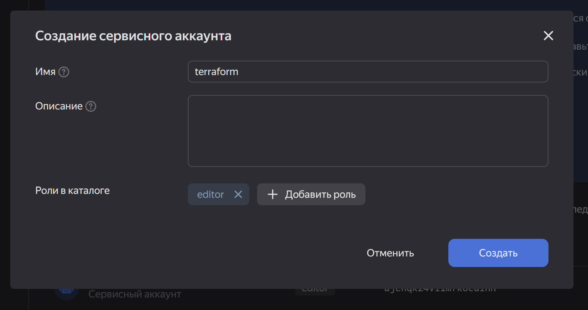

# Basic-infrastructure

Базовая инфраструктура для веб-проекта используя подход IaC (Terraform) 

Для начала нужно создать сервисный аккаунт для terraform

так же нужно сгенерировать статический ключ доступа, чтобы терраформ мог обращаться к облаку

