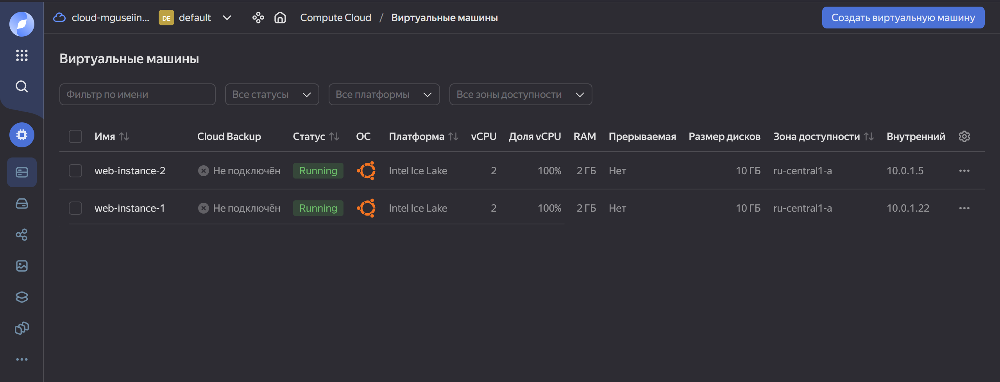

# Basic-infrastructure

Базовая инфраструктура для веб-проекта используя подход IaC (Terraform) 

Условия задания:
- Для инфраструктуры можно использовать один регион и только одну зону
   доступности (AZ). 
- Веб-сервер должен работать на nginx или caddy 
- Настройка веб-сервера и ПО на сервере должна быть выполнена с помощью
   cloud-init 
- Можно использовать следующие облачные провайдеры: Yandex.Cloud,
   DigitalOcean, Timeweb, Google Cloud, Amazon Web Services
   Этапы:
- Создание сети 
- Создание группы серверов (или серверов если облачный провайдер не
   поддерживает группы)
- Создание Load Balancer для реверс-проксирования и распределения нагрузки 
- Настройка безопасности на серверах на уровне сети (разрешать только 80/443
   порты в LB)

## 1. Настройка окружения

Для работы потребуется:

- Аккаунт в Yandex Cloud
- Terraform
- Сервисный аккаунт и статический ключ доступа


- Так же нужно сгенерировать статический ключ доступа, чтобы терраформ мог обращаться к облаку


- Нужно настроить провайдер в terraform. Базовую настройку можно найти в документации Яндекс облака


Указываем какой провайдер будет использовать терраформ и настраиваем сам провайдер
```terraform
terraform {
  required_providers {
    yandex = {
      source = "yandex-cloud/yandex"
    }
  }
}

provider "yandex" {
  service_account_key_file = "key.json"
  cloud_id                 = "b1gklhrcrgeagtrkql4a"
  folder_id                = "b1gcirasqg53q97lgl7j"
  zone                     = "ru-central1-a"
}
```

## 2. Создание сети

- Создаем виртуальную сеть и подсеть для веб-серверов.
```terraform
resource "yandex_vpc_network" "web_network" {
  name = "web-network"
}

resource "yandex_vpc_subnet" "web_subnet" {
  name           = "web-subnet"
  zone           = "ru-central1-a"
  network_id     = yandex_vpc_network.web_network.id
  v4_cidr_blocks = ["10.0.1.0/24"]
}
```

- По заданию, сервера нужно настроить с помощью cloud-init. Устанавливаем nginx и запускаем службу
```yaml
packages:
  - nginx
runcmd:
  - systemctl enable nginx
  - systemctl start nginx
```

## 4. Развертывание веб-серверов
- Теперь нужно создать группу для серверов. Здесь так же указываются основные данные по серверу. Сервисный аккаунт от имени которого будет совершать действия terraform, образ (в данном случае Ubuntu 24.04), кол-во ядер, озу, тип диска, файл cloud-init и т.д.

```terraform
resource "yandex_compute_instance_group" "web_group" {
  name               = "web-server-group"
  folder_id          = local.folder_id
  service_account_id = "ajeij91hqc2c844bjvqu"

  instance_template {
    platform_id = "standard-v3"
    resources {
      cores  = 2
      memory = 2
    }

    boot_disk {
      initialize_params {
        image_id = "fd82odtq5h79jo7ffss3"
        size     = 10
        type = "network-ssd"
      }
    }

    network_interface {
      subnet_id = yandex_vpc_subnet.web_subnet.id
      nat       = true
      security_group_ids = [yandex_vpc_security_group.web_sg.id]
    }

    metadata = {
      user-data = file("cloud-init.yaml")
    }
  }

  scale_policy {
    fixed_scale {
      size = 2
    }
  }

  allocation_policy {
    zones = ["ru-central1-a"]
  }
}
```

6. Настройка балансировщика нагрузки

- Балансировщик cлушает на 80 и 443 порту и перенаправляет трафик на те же порты серверов

```terraform
resource "yandex_lb_target_group" "web_target_group" {
  name = "web-target-group"

  target {
    subnet_id = yandex_vpc_subnet.web_subnet.id
    address   = yandex_compute_instance.web_instance_1.network_interface.0.ip_address
  }

  target {
    subnet_id = yandex_vpc_subnet.web_subnet.id
    address   = yandex_compute_instance.web_instance_2.network_interface.0.ip_address
  }
}

resource "yandex_lb_network_load_balancer" "web_lb" {
  name = "web-load-balancer"

  listener {
    name        = "http-listener"
    port        = 80
    target_port = 80
    protocol    = "tcp"
  }

  listener {
    name        = "https-listener"
    port        = 443
    target_port = 443
    protocol    = "tcp"
  }

  attached_target_group {
    target_group_id = yandex_lb_target_group.web_target_group.id
    healthcheck {
      name = "http"
      http_options {
        port = 80
        path = "/"
      }
    }
  }
}

```

## 7. Настройка безопасности
- Настройка брандмауэра, разрешаем на вход 80 и 443 порты, исходящий трафик разрешен весь

```terraform
resource "yandex_vpc_security_group" "web_sg" {
  name       = "web-security-group"
  network_id = yandex_vpc_network.web_network.id

  ingress {
    protocol       = "TCP"
    port           = 80
    v4_cidr_blocks = ["0.0.0.0/0"]
  }

  ingress {
    protocol       = "TCP"
    port           = 443
    v4_cidr_blocks = ["0.0.0.0/0"]
  }

  egress {
    protocol       = "ANY"
    v4_cidr_blocks = ["0.0.0.0/0"]
  }
}
```
## 8. Применение конфигурации

- Запускаем terraform apply:


- сервера на самом сайте


- обе машины пингуются


## 9. Вывод

- Автоматизировано развертывание инфраструктуры
- Два веб-сервера с балансировкой нагрузки
- Конфигурация управляется через Terraform
- Установлен и настроен Nginx через cloud-init
- Настроены правила брандмауэра
